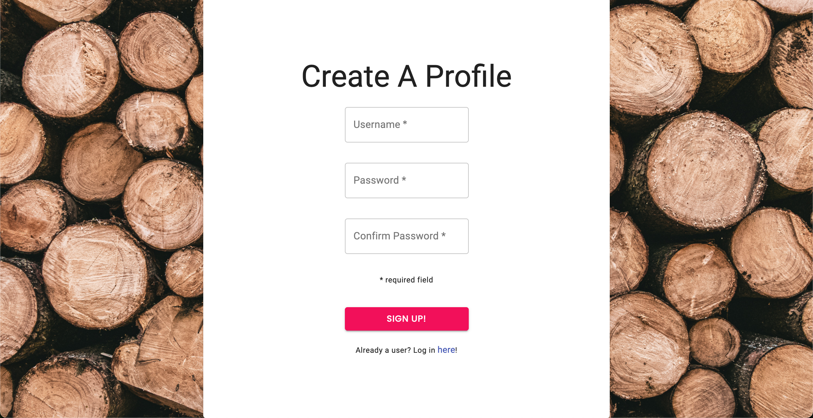

## MTLA

# _My Training Log App_

---

## Description

Over the years, my background as a personal trainer has led me through an assortment of _training apps_ and tinkering with my own preffered methods of _logging my own workouts_.
Since nothing has ever matched exactly what I want, I decided to take things into my own hands...
 
 

MTLA is a full stack (MERN) application including:

- User login and signup with bcrypt authorization

  
  
  

- Log View or This Week view of stored workouts.

- Add workout to any date in log.

- Customize personal exercise libraries.

> My Training Log App began just for **me**... But I hope it's something you will enjoy as well!

---

## Installation

From myTrainingLogApp repo:

- Fork and clone to local directory
- Run `npm install` from root
- Start _server_ and _database_ connections with `npm start`
- Build bundle.js file with webpack, `npm start pack`
- Open up in browser at `localhost:1703`!

---

## Tech Used

- ReactJS
- MongoDB
- ExpressJS
- NodeJS
- Bcrypt
- Luxon (_date management_)
- React Router
- Babel
- Webpack
- MaterialUI

---

## Deployment

Check out the deployed app:

## ([**UNDER CONSTRUCTION**](http://mytraininglogapp.herokuapp.com))!

---
